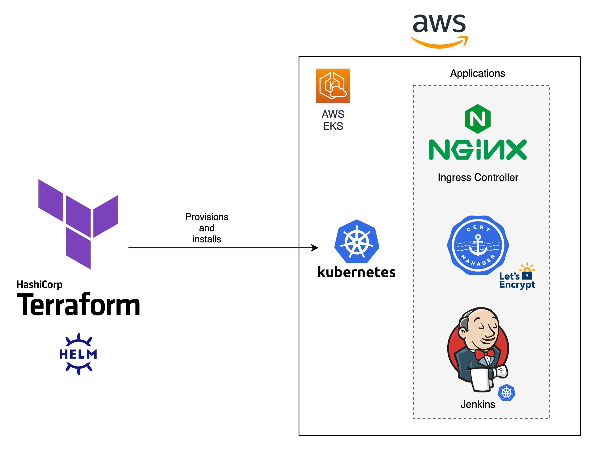

# Design

## Infrastructure as Code

The solution is deployed with Infrastructure as Code (IaC) using **terraform**. An AWS EKS cluster is provisioned and configured with per environment _namespaces_, _Availability Zones_ and a _Network Load Balancer_.

Using Helm terraform provider, the following applications are installed:

- NGINX Ingress Controller for routing incoming traffic to the applications.
- Cert Manager handles automatic certificates creation and renewal with Let's Encrypt.
- Jenkins on Kubernetes, highly scalable and efficient on resource consumption.

&nbsp;

## Pipeline

Pipeline design is highly dependent on the version control branching model that the development team adopts for a project/application. In this design, I propose three long living branches each mapped to different namespaces on the K8s cluster:

1. A development branch (`develop`), where the development of new features are implemented. All `feature/*` branches are be based on this branch and are validated with a CI pipeline before integrating them.
1. A "user acceptance" (UAT) branch (`stage`) where mature new features are tested by QA, end users and further automated tests.
1. A production branch (`master`) that should only receive hot fixes (critical bugs) and code from `stage` once all the manual and automated testing has been completed.

Hotfix branches should be based on `master` and directly integrated to `master` and `develop`.

The integration pipeline and chosen tools were built to guarantee code quality in accordance with the DevSecOps model (shift left security).

1. SCM Code Checkout
1. Build Code (Maven)
1. Testing (parallel jobs)
   - Code testing (JUnit)
   - [gitleaks](https://github.com/zricethezav/gitleaks) -> Hard coded API Keys, Secrets, Credentials in git repos detection.
   - [SonarCloud](https://sonarcloud.io/) -> Code quality and SAST (Static Application Security Testing)
   - [Snyk](https://snyk.io) -> Open source dependencies and licenses scanning (could be used for IaC and configuration as well)
1. [Kaniko](https://github.com/GoogleContainerTools/kaniko) -> build Docker container images in K8s securly without exposing Docker daemon.
1. [trivy](https://github.com/aquasecurity/trivy) -> scan container image vulnerabilities
1. Deploy to K8s with [Helm](https://helm.sh) per long living branch/environment (`prod`, `stage`, `dev`). Security best practices has been taken into consideration here (Automatic HTTPS, non-root containers, no privilege escalation).

## Observability

Application and infrastructure observability are achieved with monitoring and logging. Using open source tools designed with K8s in mind we have a complete solution.

Observability is based on:

1. Collecting data from the application and infrastructure (Networking, CPU, RAM, Disk I/O, Disk space...).
1. Monitoring
1. Alerting
1. Analysis

### Monitoring

Prometheus works by pulling metrics from infrastructure resources and applications. Grafana is used for visualization and analysis of the data captured. Any sort of alerts may be configured and triggered with Alertmanager so a quick response to an incident is possible.

### Logging

We can use the EFK stack (Elasticsearch, Fluent Bit, Kibana) for log processing and analysis. Fluent Bit is a log processor that collects, pareses, filters and aggregates data before sending it to different outputs. Elasticsearch is a database that excels at full search text at near real time, so it's ideal for this task. Kibana is used to interact with the collected data by searching and visualization.

Logs -> Fluent Bit -> Elasticsearch -> Kibana

Developer logging discipline is paramount here in order to have valuable data. Each application event and error should have a

### SLAs and SLOs

SLAs are commonly defined by business

Resource optimization (costs)
Operational health

## High Availability

Autoscaling applications and infrastructure.
Liveness and Health Probes and Self-healing.

Non critical applications -> Rolling updates

Mission critical -> Blue/green or canary deployments

## Additional Considerations

- Advantages and pitfalls of using Jenkins on K8s
- Developer culture, process and tooling may be further improved
  - PRs/code review process
  - Code quality tools (linters) on IDEs for real time feedback.
  - git hooks

## Possible Improvements

- Automatic SemVer tagging.
- DAST (Dynamic Application Security Testing) can be automated in the pipeline.
- Further testing (regression, E2E) with something like Selenium may be automated in the pipeline.
- K8s Network Policies should be implemented to isolate each namespaced environment.
- Compliance tools may be added to the pipelines.
- Installation and initial setup for monitoring (Prometheus/Grafana) and logging (EFK) could be implemented with IaC.
- A separate cluster for production could guarantee security isolation and better resource management.
- Monitoring and logging could also be implemented with cloud provided solutions (AWS CloudWatch) or 3rd party tools (like WatchDog).
