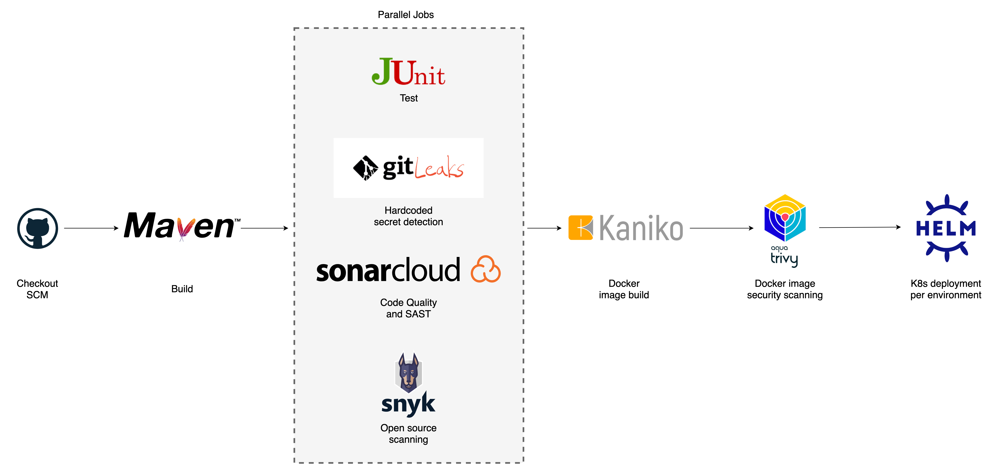

# Design

## Infrastructure as Code

The solution is deployed with Infrastructure as Code (IaC) using **terraform**. An AWS EKS cluster is provisioned and configured with per environment _namespaces_, _Availability Zones_ and a _Network Load Balancer_.

Using Helm terraform provider, the following applications are installed:

- NGINX Ingress Controller for routing incoming traffic to the applications.
- Cert Manager handles automatic certificates creation and renewal with Let's Encrypt.
- Jenkins on Kubernetes, highly scalable and efficient on resource consumption.

&nbsp;

## Pipeline

Pipeline design is highly dependent on the version control branching model that the development team adopts for a project/application. In this design, I propose three long living branches each mapped to different namespaces on the K8s cluster:

1. A development branch (`develop`), where the development of new features are implemented. All `feature/*` branches are based on this branch and validated with a CI pipeline before integrating them.
1. A "user acceptance" (UAT) branch (`stage`) where mature new features are tested by QA, end users and further automated tests.
1. A production branch (`master`) that should only receive hot fixes (critical bugs) and code from `stage` once all the manual and automated testing has been completed.

Hotfix branches should be based on `master` and directly integrated to `master` and `develop`.

The integration pipeline and chosen tools were built to guarantee code quality in accordance with the DevSecOps model (shift left security).

&nbsp;

1. Checkout SCM
1. Build Code (Maven)
1. Testing (parallel jobs)
   - Code testing (JUnit)
   - [gitleaks](https://github.com/zricethezav/gitleaks) -> Hard coded API Keys, Secrets, Credentials in git repos detection.
   - [SonarCloud](https://sonarcloud.io/) -> Code quality and SAST (Static Application Security Testing).
   - [Snyk](https://snyk.io) -> Open source dependencies and licenses scanning (could be used for Docker, IaC and configuration as well)
1. [Kaniko](https://github.com/GoogleContainerTools/kaniko) -> Builds Docker container images in K8s securely without root privileges or exposing Docker daemon.
1. [trivy](https://github.com/aquasecurity/trivy) -> Docker container image vulnerability scan.
1. Deploy to K8s with [Helm](https://helm.sh) per long living branch/environment (`prod`, `stage`, `dev`). Security best practices has been taken into consideration here (Automatic HTTPS, non-root containers, no privilege escalation).

## Observability

Application and infrastructure observability are achieved with monitoring and logging. Using open source tools designed with K8s in mind we could have a complete solution in place.

### Monitoring

Prometheus is a common tool used in K8s environments that works by pulling metrics from infrastructure resources and applications. Grafana is used for visualization and analysis of the captured data through dashboards. Any sort of alerts may be configured and triggered with Alertmanager so a quick response to events is possible. The following architecture diagram taken from the Prometheus documentation gives us a quick overview of the components and flows involved:

&nbsp;

  

### Logging

We can use the EFK technology stack (Elasticsearch, Fluent Bit, Kibana) for log processing and analysis. Fluent Bit is a log processor that collects, parses, filters and aggregates data before sending it to different outputs. Elasticsearch is a database that excels at full search text at near real time, so it's ideal for storing and querying logs. Kibana is used to interact with the collected data by searching and visualizations.

Logs -> Fluent Bit -> Elasticsearch -> Kibana

Developer logging discipline is paramount here in order to have valuable data to perform quick diagnostics. Every application event and error should be logged with a standard format so processing and storing logs helps tracing what is going on.

### SLIs, SLOs and SLAs

With monitoring and logging in place we can define what SLIs (Service Level Indicators) should be measured for our service and then what should be our targets (Service Level Objectives). Common SLIs for applications that are consumed by other services or end users are:

1. Request latency -> How long does it take to respond to a request.
1. System Throughput -> Number of requests per second.
1. Availability -> Commonly measured in percentage over a period of time.
1. Error rate -> Percentage of errors for well formed requests.

Based on this common SLIs we can set our SLOs. At first glance we would like to have everything work perfectly a 100% of the time for every single request, but those are not realistic expectations. In a real world scenario, systems go down and do have errors. The SLOs for our service should always be based on the business use case, so this proposal is far from complete without having an idea of the purpose and criticality level of the service. A base proposal could be the following:

- Average request latency should be less than a 100 milliseconds.
- The service should be able to handle 300 requests per second.
- The service should be available 99% of the time.
- The error rate should be less than 0.5%.

Based on this SLOs we can proceed with the SLAs. These are contracts with the "outside world" that the end users of our service can rely on and what are the consequences of infringing or missing the targets.

## High Availability

High availability should be considered from the inception of the architecture design by using cloud native solutions like _Availability Zones_ and _redundancy_.
_Autoscaling_ may help us in this quest by answering to high load demands without human intervention. In K8s this should be configured at the infrastructure level (number and size of nodes) and at the application level in K8s (deployment replicas, horizontal pod autoscaler and vertical pod autoscaler).

Another important consideration that applies to highly available systems are critical application errors (like memory leaks and uncaught exceptions) that will render them unresponsive. K8s is a self-healing system by design, but it needs correct configuration of liveness and health probes in order to work properly.

The most recommended deployment strategy for highly available systems are blue/green deployments, where we have 2 completely identical and separate production ready environments that contain different versions of the application. One holds the current version and the other the new version to be deployed. Traffic is then switched from the environment that holds the current version to the new version. Health checks are performed and if everything is ok, the routing stays in place. If something is wrong with the newly deployed version, going back to the previous version is a simple routing switch away.

The biggest downside of this strategy apart from the complexity of maintaining both systems, is costs. It needs to have 2 completely fully functional and identical environments, one of them being idle until a new deployment is due, and the traffic switch happens for the new version.

## Additional Considerations

- Developer culture, process and tooling may be further improved
  - PRs/code review process
  - Code quality tools (linters) on IDEs for real time feedback.
  - git hooks
- Monitoring and logging could also be implemented with cloud provided solutions (AWS CloudWatch) or 3rd party tools (like WatchDog).

## Possible Improvements

- Automatic SemVer tagging.
- DAST (Dynamic Application Security Testing) could be automated in the pipeline after `stage` (UAT) deployments or periodically.
- Further testing (regression, E2E) with something like Selenium may be automated in the pipelines.
- K8s Network Policies should be implemented to isolate each namespaced environment.
- Compliance tools should be added to the pipelines.
- Installation and initial setup for monitoring (Prometheus/Grafana) and logging (EFK) should be implemented with IaC.
- A separate cluster for production could guarantee security isolation.
